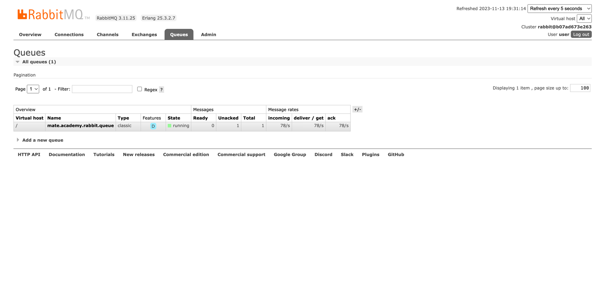

# RabbitMQ example

Welcome to RabbitMQ demo!

Run the app and try to send a simple queue message!

## Pre requirements
- Verify you have installed and running Docker

## Run the app
To run the project execute the following commands:
```shell
./message-receiver/mvnw clean package -f ./message-receiver/pom.xml
./message-sender/mvnw clean package -f ./message-sender/pom.xml
docker-compose build
docker-compose up
```

or just run the [Makefile](https://makefiletutorial.com/). See how to install for [MacOS](https://formulae.brew.sh/formula/make)
```shell
make first-run
```

## Send a message

You can send the message by using [Postman](https://www.postman.com/):
- POST: http://localhost:8081/send
```json
{
    "content": "hello, mates!"
}
```

or you can send the request using `curl` (for MacOS and unix system (like Ubuntu, CentOS, etc...))
```shell
curl --location 'http://localhost:8081/send' \
--header 'Content-Type: application/json' \
--data '{
    "content": "hello, mates!"
}'
```

## What about RabbitMQ?
Once you run the app using docker-compose feel free to visit the http://localhost:15672/#/queues and verify the list of queues.
You should see something like that:


Also, feel free to imitate the sending of bunch messages to queue by running [send-message-in-a-loop.sh](./send-message-in-a-loop.sh) script:
```shell
bash send-message-in-a-loop.sh
```

## Contribution
We are happy to see your involvement in this and other projects! Feel free to create a PR with any improvements and bug fixes to this repo! Once you will create a PR, ping coach or mentor and ask them to review it! It could be a first step to your open source contribution!
